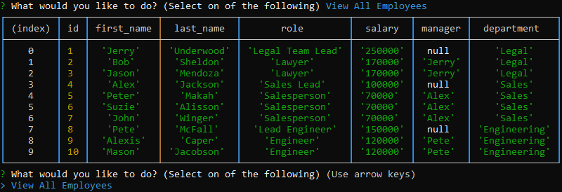

# Employee-tracker

## Description

This project will allow an employer to add and update an employee roster with an easy and simple to use CMS.

## Table of Contents

- [Installation](#installation)
- [Usage](#usage)
- [Instructions](#instructions)
- [License](#license)
- [Questions](#questions)

## Installation

In order to install this project you must clone this project on to your local machine.

## Usage

This project usage is for anyone that needs to organize their employees and departments with a CMS

## Instructions

- Step 1: Clone this repository

- Step 2: Open the MySQL CLI by typing mysql -u root -p in your bash (Ensure you have MySQL downloaded on your local machine!)

- Step 3: In the MySQL CLI, type 'source db/schema.sql' to populate the database and tables

- Step 4: (Optional) If you would like predefined employees, roles, and departments type 'source db/seed.sql'

- Step 5: Type quit in order to leave the MySQL CLI

- Step 6: Run 'node index' in the terminal while in root directory of the cloned project

- Step 7: Use any of the prompts provided to add or update employees, roles, and departments!

* 

* Step 8: Once you are finished press 'ctrl + C' to exit the program!
## License

Copyright (c) 2021 Carlo Joshua Serame

Permission is hereby granted, free of charge, to any person obtaining a copy of this software and associated documentation files (the "Software"), to deal in the Software without restriction, including without limitation the rights to use, copy, modify, merge, publish, distribute, sublicense, and/or sell copies of the Software, and to permit persons to whom the Software is furnished to do so, subject to the following conditions:

The above copyright notice and this permission notice shall be included in all copies or substantial portions of the Software.

THE SOFTWARE IS PROVIDED "AS IS", WITHOUT WARRANTY OF ANY KIND, EXPRESS OR IMPLIED, INCLUDING BUT NOT LIMITED TO THE WARRANTIES OF MERCHANTABILITY, FITNESS FOR A PARTICULAR PURPOSE AND NONINFRINGEMENT. IN NO EVENT SHALL THE AUTHORS OR COPYRIGHT HOLDERS BE LIABLE FOR ANY CLAIM, DAMAGES OR OTHER LIABILITY, WHETHER IN AN ACTION OF CONTRACT, TORT OR OTHERWISE, ARISING FROM, OUT OF OR IN CONNECTION WITH THE SOFTWARE OR THE USE OR OTHER DEALINGS IN THE SOFTWARE.
## Questions

Created by: [CJSerame24](https://github.com/CJSerame24)

If you have any further questions please feel free to contact me at [carloserame24@gmail.com](carloserame24@gmail.com)
